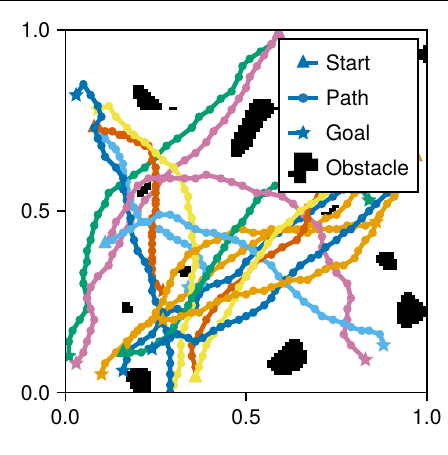

# Diffusers for path planning

Fork of Hugging Face [Diffusers](https://github.com/huggingface/diffusers) by Petr Zahradník with additional features and fixes for 1D diffusion.



Courtesy of the master's thesis "Diffusion models for path planning". Will be published soon.

Features added to 1D U-Net:

- Coalesce U-Net block classes for consistency
- Allow tuning of many internal parameters (normalization, activation, padding, time embedding)
- Support for Dropout
- Support for LoRA convolution
- Simplify ResNet skip connections handling

Why? Upstream implementation follows closely Janner's [Diffuser](https://github.com/jannerm/diffuser). Our fork diverges to simplify both the implementation and usage. The code is rewritten to follow the 2D U-Net which is much more advanced.


## Installation

This fork is not published on pip. It must be installed from the source code:

```bash
pip install .
```

## Usage

Refer to the [Diffusers documentation](https://huggingface.co/docs/diffusers), this fork is mostly compatible.

The training script used in the thesis is in [train.py](train.py).

## Credits

License: Apache-2.0 by HuggingFace Team and Petr Zahradník
